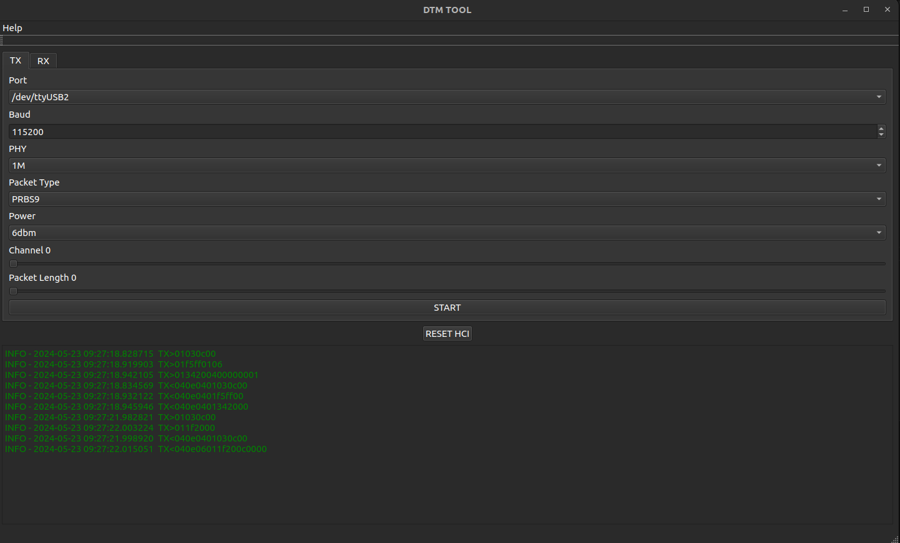
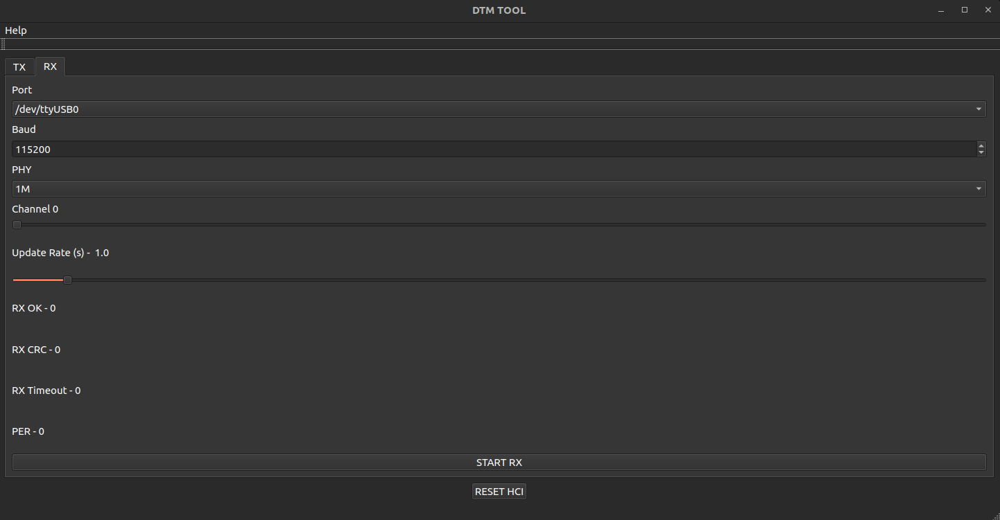

# BLE DTM GUI
Control TX and RX DTM from the comfort of the GUI

## TX

- Port: Serial port to connect to as HCI
- Baud: Baudrate for HCI device
- PHY: Data rate standard
- Packet Type: Data output type
- Power: Transmit power
- Channel: RF channel to transmit on
- Packet Length: Length of data packet in bytes 

## RX

- Port: Serial port to connect to as HCI
- Baud: Baudrate for HCI device
- PHY: Data rate standard
- Channel: RF channel to transmit on
- Update Rate: How frequently to update RX stats
- RX OK: Number of properly received packets
- RX CRC: Number of packets received with CRC error
- RX Timeout: Number of timeouts waiting for packet
- PER: Packet Error Rate
<b> 
PER = (RX_OK) / (RX_OK + RX_CRC + RX_Timeout)


# Dependencies
The BLE-HCI backend can be installed from PyPi or from source 
```
pip install max-ble-hci
```

The HCI can be found at [MAX-BLE-HCI](https://github.com/Analog-Devices-MSDK/MAX-BLE-HCI)

## Running from python directly

```bash
pip install -r requirements.txt
python3 dtm_tool.py
```

## Creating Binary

```bash
pip install pyinstaller
pyinstaller dtm_tool.py
```
